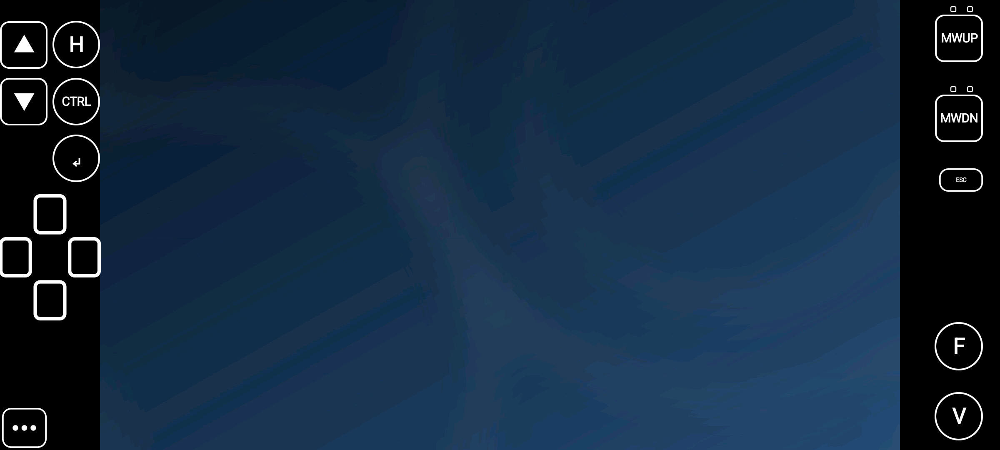

# vncviewer-for-games

📄 Project page: **[An Android VNC client built for playing games, not for desk work](https://zirize.github.io/vncviewer-for-games/)** · More projects: **[zirize.github.io](https://zirize.github.io/)**

An Android VNC client for **playing games** on a remote desktop — not for desk work.



Every VNC viewer already out there is built for administering machines: small text, precise
pointing, a keyboard you summon when you need it. Play a game through one and you spend the
whole time fighting the client. This one is the other shape: **large touch buttons that are
always there**, modifiers that latch so you are not holding two fingers down, a D-pad, and a
wheel — arranged in the black margins beside the remote screen so they cost you no picture.

The button layout is **data, not code**. It lives in [`profiles/default.json`](profiles/default.json),
and you can regenerate it for whoever is going to hold the phone.

> **Two names, one codebase.** The project is `vncviewer-for-games`. The build published on
> Google Play is called **RemotePad** (`tech.doldam.remotepad`). They are the same source; only
> the application id differs, so a fork can never overwrite the published app. See
> [`app/build.gradle.kts`](app/build.gradle.kts).

## Trying it on your phone

RemotePad is on Google Play, on the **internal testing** track. The track is live, but it is
invitation only: Play matches the tester list against the account that opens the link, so a link
does nothing at all for someone who is not on that list. That is why there is no link here.

**Want in? Send the Google account address you would install it with to
[zirize@gmail.com](mailto:zirize@gmail.com)** — by email, **not in an issue**, so your address does
not end up on a public page. I add you to the tester list and send the link back to you; it starts
working once you are on the list, not before. The track holds **up to 100 testers** — more can be
invited than that, but only the first hundred to join count.

A few things worth knowing before you write:

- 🔑 It has to be the address of the **Google account on the phone**. Play matches the tester list
  against the account that opens the link, so any other address will simply say the app is not
  available — and that symptom tells you nothing about why.
- The address is used to add you as a tester and to send you the link. Nothing else. The app itself
  collects nothing; see the [privacy policy](https://zirize.github.io/vncviewer-for-games/privacy.html).
- Android **7.0 or newer** (API 24).
- You will need a VNC server to point it at. This is a client; it does not come with one.

If you would rather not hand over an address, build it yourself — the next section is for you, and
the result is the same app.

## What it does

- **On-screen controls in the margins.** Page Up / Page Down, Ctrl, Enter, Esc, a D-pad, mouse
  wheel up/down, and free letter keys. Drawn on a 60%-black background with a white outline so
  they stay readable over a bright screen; anywhere that is not a button passes straight through
  to the trackpad.
- **Latching modifiers.** Tap Ctrl for one-shot, tap twice to lock. You do not need a second hand.
- **Trackpad or absolute pointing.** Long-press for right click, two-finger scroll.
- **Tight/JPEG decoding on four worker threads**, through libjpeg-turbo with NEON.
- **Typing, for when the game asks for a name.** The settings sheet opens with a text field at
  the top; you type with the phone's own keyboard — so your IME's language is your business, not
  this app's — and it goes out as **key presses, not a clipboard paste**, which is why it lands
  inside a game too.
- **A settings sheet that opens itself** if the very first connection fails, so a fresh install
  is never a dead end.

## Build

You need JDK 17 and an Android SDK with NDK. Then:

```bash
git clone --recursive https://github.com/zirize/vncviewer-for-games.git
cd vncviewer-for-games
bash scripts/doctor.sh          # checks the toolchain; changes nothing
bash scripts/build.sh           # release APK
bash scripts/build.sh install   # ...and push it to a connected device
```

`--recursive` matters: libjpeg-turbo is a submodule. If you already cloned without it,
`git submodule update --init --recursive`.

If `doctor.sh` cannot find your JDK or SDK, add your path to `scripts/_hostenv.sh` — that file is
the single place host-specific paths are allowed to live.

> Release builds are signed with a debug key unless a `keystore.properties` exists. Use release
> builds for everyday work: debug builds are visibly slower, because `debuggable` makes ART give
> up optimisations (measured: 20.8 fps vs 33.2 fps on a full-motion test).

**No APK is published here, and that is deliberate.** A signed APK carries its signing certificate,
and anyone holding the file can read that certificate without a password — so shipping builds would
also ship whatever identifying details the signer put in it. Build from source, or install the
published build from Google Play.

## Make it fit your hands

```bash
cp profiles/default.json profiles/mine.json
$EDITOR profiles/mine.json
bash scripts/build.sh preview                          # validate + draw an SVG of the result
bash scripts/build.sh release -PvncProfile=mine.json    # build with it
```

The format is documented in [`docs/layout-profile.md`](docs/layout-profile.md), and
[`docs/make-a-variant.md`](docs/make-a-variant.md) is a step-by-step recipe with what to do when
each step fails.

**You do not need the device to check your work.** Validation and the SVG preview both run on a
plain JVM. That is deliberate — see below.

## This repository expects to be read by agents

Most of the time the person who wants a different layout will not edit the JSON themselves; they
will ask a coding agent to do it. So the repository is built to let an agent **prove it got it
right** without hardware:

- `bash scripts/build.sh preview` validates every profile and renders each one to
  `app/build/preview/<id>.svg`.
- Deliberately broken profiles live in `app/src/test/resources/broken-profiles/` and are part of
  the test suite, so the checks themselves are checked.
- [`AGENTS.md`](AGENTS.md) is the entry point, including the things an agent must refuse.

The single most important rule: **a layout must keep a way into settings.** Remove that button and
the person holding the phone can no longer change anything — the validator rejects it.

## Licence

GPL-2.0-or-later. This is not a preference: the viewer is built on the
[TigerVNC](https://github.com/TigerVNC/tigervnc) Java client, which is GPL-2.0-or-later, so the
combined work is too. Full text in [`LICENSE`](LICENSE); third-party components and their notices
are in [`NOTICE`](NOTICE).
